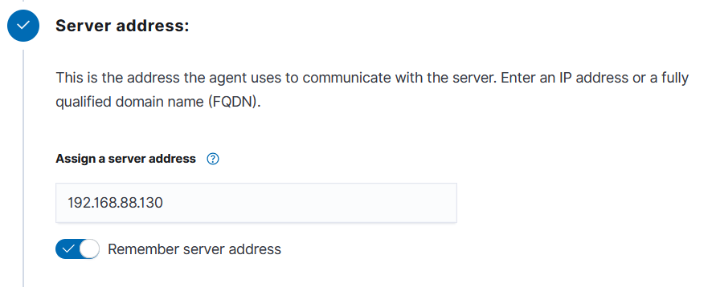

# Wazuh Agent Installation Guide - RHEL Agents ( RHEL )

## Prerequisites

- **Operating System**: RHEL  (Version 10 or later)
- **Administrative Privileges**: Required for installation
- **Network Access**: Ensure the Linux machine can communicate with the Wazuh Manager

## Environment Details

- **Wazuh Manager IP**: `192.168.88.130`
- **Agent Name**: `RHEL`
- **Agent Group**: `default`

## Installation Steps

### Step 0:  Installation W11 on a VM

Installation of RHEL on a VM.


### Step 1: Access Wazuh Web Interface

1. Open your web browser and navigate to your Wazuh Manager dashboard
2. Go to **Agents** → **Deploy New Agent**

  

### Step 2: Select Package Type

From the deployment wizard:

1. **Select the package to download and install on your system:**
   - Choose **d** for  package

   

### Step 3: Configure Server Address

1. **Server address**: Enter your Wazuh Manager IP address
   ```
   192.168.88.130
   ```
2. Check **"Remember server address"** if desired

   

### Step 4: Optional Settings

1. **Assign an agent name** (optional):
   ```
   RHEL
   ```
   > **Note**: The agent name must be unique and cannot be changed once enrolled. If left blank, the hostname will be used.

2. **Select one or more existing groups**:
   - Select **"windows-agents"** group (create if it doesn't exist)
   - Default group is available if no custom group is needed

   


## Security Considerations

- Ensure the Wazuh Manager IP is accessible but properly secured
- Consider using TLS/SSL encryption for agent-manager communication
- Regularly update both Wazuh Manager and agents to the latest versions
- Review and customize agent groups and rules based on your security requirements

## Additional Resources

- [Wazuh Documentation](https://documentation.wazuh.com/)
- [Wazuh Agent Configuration](https://documentation.wazuh.com/current/user-manual/agents/index.html)
- [Windows Agent Deployment](https://documentation.wazuh.com/current/installation-guide/wazuh-agent/index.html)

---

**Last Updated**: August 2025  
**Wazuh Version**: 4.12.0  
**Tested On**: Red Hat Etreprise Linux 10