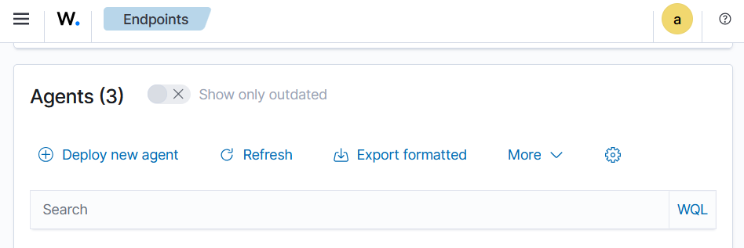

# Wazuh Agent Installation Guide - WSL Ubuntu

## Prerequisites

- **Operating System**: WSL (Windows Subsystem for Linux) with Ubuntu
- **WSL Version**: WSL 2 recommended
- **Ubuntu Version**: Ubuntu 24.04.1  LTS or later
- **Root Access**: Required for installation
- **Network Access**: Ensure WSL can communicate with the Wazuh Manager

## Environment Details

- **Wazuh Manager IP**: `192.168.88.130`
- **Agent Name**: `WSL`
- **Agent Group**: `default`

## Installation Steps

### Step 0: WSL Ubuntu

Installation of WSL-Ubuntu on W11.


### Step 1: Access Wazuh Web Interface

1. Open your web browser and navigate to your Wazuh Manager dashboard
2. Go to **Agents** → **Deploy New Agent**

  

### Step 2: Select Package Type

From the deployment wizard:

1. **Select the package to download and install on your system:**
   - Choose **DEB amd64** for Ubuntu on WSL

   

### Step 3: Configure Server Address

1. **Server address**: Enter your Wazuh Manager IP address
   ```
   192.168.88.130
   ```
2. Check **"Remember server address"** if desired

   

### Step 4: Optional Settings

1. **Assign an agent name** (optional):
   ```
   WSL-Ubuntu-Agent
   ```
   > **Note**: The agent name must be unique and cannot be changed once enrolled. If left blank, the hostname will be used.

2. **Select one or more existing groups**:
   - Default group is available if no custom group is needed

   

### Step 5: Download and Install Agent

1. **Update package repositories**:
   ```bash
   sudo apt update
   ```

2. **Install required dependencies**:
   ```bash
   sudo apt install curl apt-transport-https lsb-release gnupg
   ```

3. **Download and install the Wazuh agent**:
   ```bash
   # Download the Wazuh agent package
   curl -so wazuh-agent.deb https://packages.wazuh.com/4.x/apt/pool/main/w/wazuh-agent/wazuh-agent_4.12.0-1_amd64.deb
   
   # Install the agent
   sudo WAZUH_MANAGER="192.168.88.130" WAZUH_AGENT_NAME="WSL-Ubuntu-Agent" dpkg -i ./wazuh-agent.deb
   ```

   

### Step 6: Start the Agent

1. **Enable and start the Wazuh agent service**:
   ```bash
   sudo systemctl daemon-reload
   sudo systemctl enable wazuh-agent
   sudo systemctl start wazuh-agent
   ```
   

2. **Verify the service is running**:
   ```bash
   sudo systemctl status wazuh-agent
   ```

   

## WSL-Specific Considerations

### Systemd in WSL

If you're using WSL 2 with systemd disabled, you may need to start the agent manually:

```bash
# Check if systemd is available
systemctl --version

# If systemd is not available, start manually
sudo /var/ossec/bin/wazuh-control start
```

### Enable Systemd in WSL :

To enable systemd in WSL 2:

1. Edit `/etc/wsl.conf`:
   ```bash
   sudo nano /etc/wsl.conf
   ```

2. Add the following content:
   ```ini
   [boot]
   systemd=true
   ```

3. Restart WSL from Windows PowerShell:
   ```powershell
   wsl --shutdown
   wsl
   ```

## Verification

### Check Agent Status on Manager

On your Wazuh Manager, verify the agent is connected:

   

```bash
# List all agents
sudo /var/ossec/bin/agent_control -l

# Check specific agent status
sudo /var/ossec/bin/agent_control -i WSL
```

### Check Agent Status on WSL Ubuntu

```bash
# Check service status
sudo systemctl status wazuh-agent

# Check agent logs
sudo tail -f /var/ossec/logs/ossec.log

# Test agent configuration
sudo /var/ossec/bin/agent_control -t
```

## Troubleshooting

### Common WSL Issues

1. **Agent not connecting**:
   ```bash
   # Test connectivity to manager
   telnet 192.168.88.130 1514
   
   # Check agent configuration
   sudo cat /var/ossec/etc/ossec.conf | grep -A 5 -B 5 server
   ```

2. **Systemd not working**:
   ```bash
   # Manual agent control
   sudo /var/ossec/bin/wazuh-control status
   sudo /var/ossec/bin/wazuh-control start
   sudo /var/ossec/bin/wazuh-control restart
   ```

3. **Permission issues**:
   ```bash
   # Check ossec user permissions
   sudo ls -la /var/ossec/
   sudo chown -R ossec:ossec /var/ossec/
   ```

### Network Connectivity

WSL uses a virtual network interface. Check network configuration:

```bash
# Check IP configuration
ip addr show

# Check routing
ip route show

# Test DNS resolution
nslookup 192.168.88.130
```

### Useful Commands

```bash
# Restart Wazuh agent
sudo systemctl restart wazuh-agent

# View agent configuration
sudo cat /var/ossec/etc/ossec.conf

# Monitor logs in real-time
sudo tail -f /var/ossec/logs/ossec.log

# Check agent version
sudo /var/ossec/bin/wazuh-control info

# Manual agent enrollment (if needed)
sudo /var/ossec/bin/agent-auth -m 192.168.88.130 -A WSL-Ubuntu-Agent
```

## Configuration Files

### Main Configuration
- **Agent Config**: `/var/ossec/etc/ossec.conf`
- **Agent Key**: `/var/ossec/etc/client.keys`
- **Logs**: `/var/ossec/logs/ossec.log`

<!--
### Example Custom Configuration

Add custom log monitoring in `/var/ossec/etc/ossec.conf`:

```xml
<localfile>
  <log_format>syslog</log_format>
  <location>/var/log/auth.log</location>
</localfile>

<localfile>
  <log_format>syslog</log_format>
  <location>/var/log/syslog</location>
</localfile>
```
-->
## Security Considerations

- WSL shares the Windows host network stack
- Ensure Windows Firewall allows Wazuh agent communication
- Consider WSL security implications in your threat model
- Regularly update both WSL Ubuntu and Wazuh agent
- Monitor WSL-specific log sources for comprehensive coverage
<!--

## Performance Optimization

```bash
# Optimize agent for WSL environment
sudo nano /var/ossec/etc/ossec.conf

# Adjust log analysis frequency if needed
<global>
  <logall>no</logall>
  <logall_json>no</logall_json>
</global>
```
-->

## Additional Resources

- [WSL Documentation](https://docs.microsoft.com/en-us/windows/wsl/)
- [Wazuh Linux Agent Documentation](https://documentation.wazuh.com/current/installation-guide/wazuh-agent/wazuh-agent-package-linux.html)
- [WSL Systemd Configuration](https://devblogs.microsoft.com/commandline/systemd-support-is-now-available-in-wsl/)

---

**Last Updated**: August 2025  
**Wazuh Version**: 4.12.0  
**Tested On**: WSL 2 Ubuntu 22.04 LTS