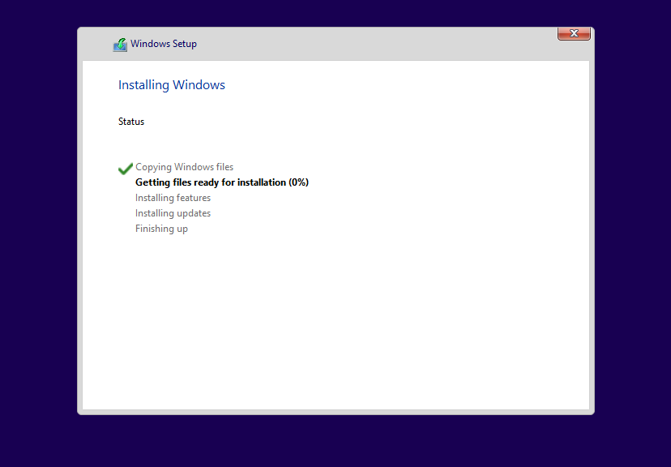
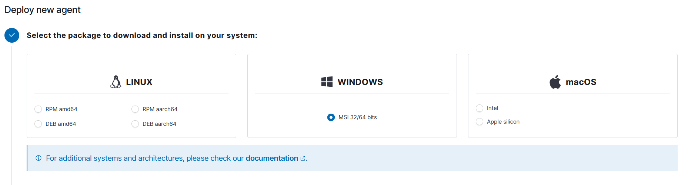
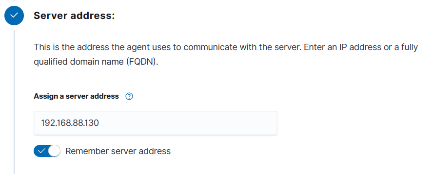
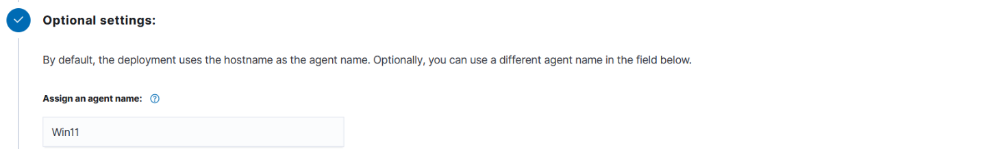
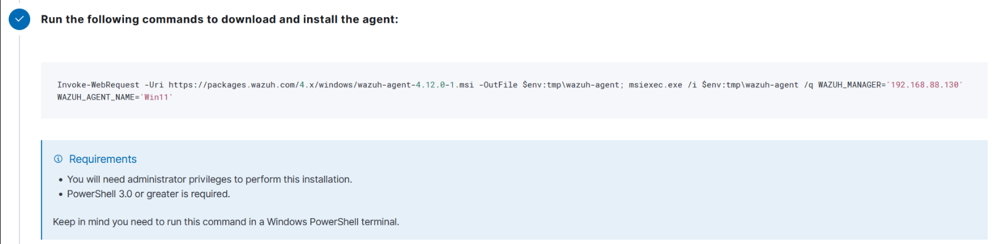
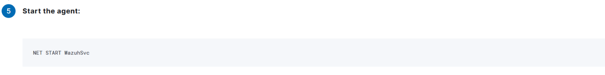
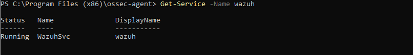
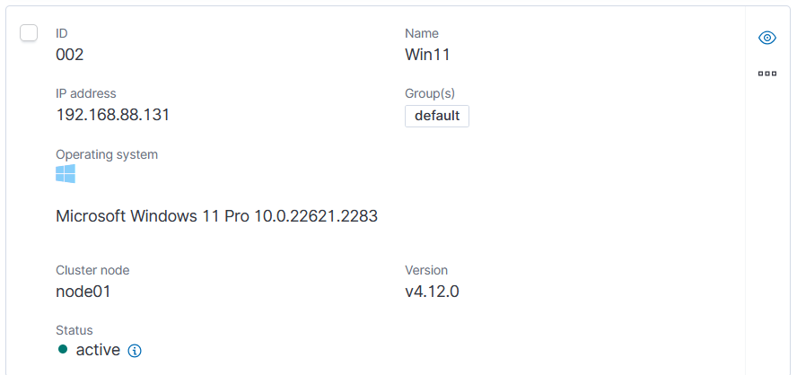

# Wazuh Agent Installation Guide - Windows Agents ( W11 )

## Prerequisites

- **Operating System**: Windows 11  (Version 22H2 or later)
- **Administrative Privileges**: Required for installation
- **Network Access**: Ensure the Windows machine can communicate with the Wazuh Manager

## Environment Details

- **Wazuh Manager IP**: `192.168.88.130`
- **Agent Name**: `W11`
- **Agent Group**: `default`

## Installation Steps

### Step 0:  Installation W11 on a VM

Installation of Windows-11 on a VM.



### Step 1: Access Wazuh Web Interface

1. Open your web browser and navigate to your Wazuh Manager dashboard
2. Go to **Agents** → **Deploy New Agent**

  

### Step 2: Select Package Type

From the deployment wizard:

1. **Select the package to download and install on your system:**
   - Choose **MSI 32/64 bits** for Windows systems

   

### Step 3: Configure Server Address

1. **Server address**: Enter your Wazuh Manager IP address
   ```
   192.168.88.130
   ```
2. Check **"Remember server address"** if desired

   

### Step 4: Optional Settings

1. **Assign an agent name** (optional):
   ```
   W11
   ```
   > **Note**: The agent name must be unique and cannot be changed once enrolled. If left blank, the hostname will be used.

2. **Select one or more existing groups**:
   - Select **"windows-agents"** group (create if it doesn't exist)
   - Default group is available if no custom group is needed

   

### Step 5: Download and Install Agent

1. **Download the agent**: The web interface will provide the download command or direct link:
   ```powershell
   # Direct download link (replace version as needed)
   https://packages.wazuh.com/4.12/wazuh-agent-4.12.0-1.msi
   ```

2. **Install the agent**: Run the following PowerShell command as Administrator:
   ```powershell
   # Example installation command (generated by Wazuh interface)
   Invoke-WebRequest -Uri https://packages.wazuh.com/4.12/wazuh-agent-4.12.0-1.msi -OutFile wazuh-agent.msi
   msiexec /i wazuh-agent.msi /q WAZUH_MANAGER="192.168.88.130" WAZUH_AGENT_NAME="W11-Agent"
   ```

   

### Step 6: Start the Agent

1. **Start the Wazuh agent service**:
   ```powershell
   NET START WazuhSvc
   ```
   

2. **Verify the service is running**:
   ```powershell
   Get-Service wazuh-agent
   ```

   The output should show the service status as "Running".

   

## Verification

### Check Agent Status on Manager

On your Wazuh Manager, verify the agent is connected:

   


***or***

```bash
# List all agents
sudo /var/ossec/bin/agent_control -l

# Check specific agent status
sudo /var/ossec/bin/agent_control -i W11
```

### Check Agent Status on Windows

```powershell
# Check service status
Get-Service wazuh-agent

# Check agent logs
Get-Content "C:\Program Files (x86)\ossec-agent\logs\ossec.log" -Tail 20
```

## Troubleshooting

### Common Issues

1. **Agent not connecting**:
   - Verify network connectivity: `Test-NetConnection 192.168.88.130 -Port 1514`
   - Check Windows Firewall settings
   - Verify Wazuh Manager firewall allows agent connections

2. **Service not starting**:
   - Check agent configuration in `C:\Program Files (x86)\ossec-agent\ossec.conf`
   - Review logs in `C:\Program Files (x86)\ossec-agent\logs\`

3. **Permission issues**:
   - Ensure installation was run as Administrator

4. **Antivirus issues**:   
   - Check Windows Defender/Antivirus exclusions
   - If the agent wasn't installed go see if the installation is still blocked in the Task Manager.

### Useful Commands

```powershell
# Restart Wazuh agent service
Restart-Service wazuh-agent

# Check agent configuration
Get-Content "C:\Program Files (x86)\ossec-agent\ossec.conf"

# View real-time logs
Get-Content "C:\Program Files (x86)\ossec-agent\logs\ossec.log" -Wait
```

## Security Considerations

- Ensure the Wazuh Manager IP is accessible but properly secured
- Consider using TLS/SSL encryption for agent-manager communication
- Regularly update both Wazuh Manager and agents to the latest versions
- Review and customize agent groups and rules based on your security requirements

## Additional Resources

- [Wazuh Documentation](https://documentation.wazuh.com/)
- [Wazuh Agent Configuration](https://documentation.wazuh.com/current/user-manual/agents/index.html)
- [Windows Agent Deployment](https://documentation.wazuh.com/current/installation-guide/wazuh-agent/index.html)

---

**Last Updated**: August 2025  
**Wazuh Version**: 4.12.0  
**Tested On**: Windows 11 Pro 22H2