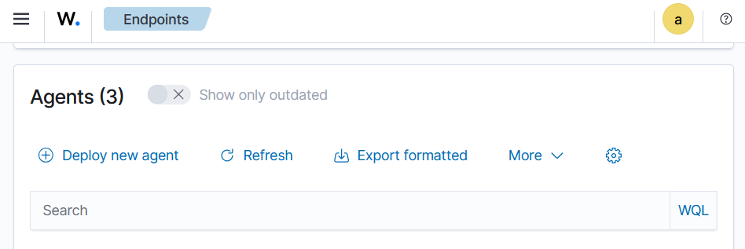
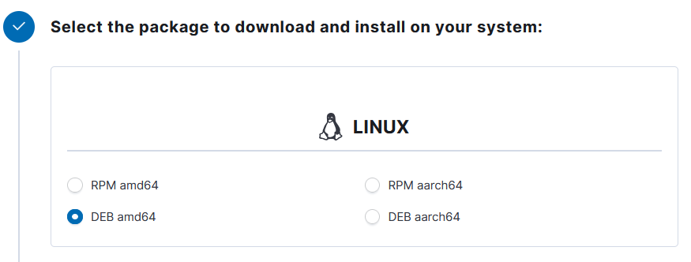
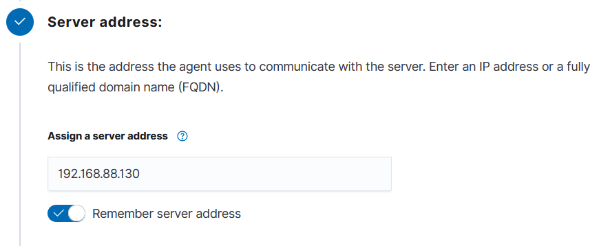
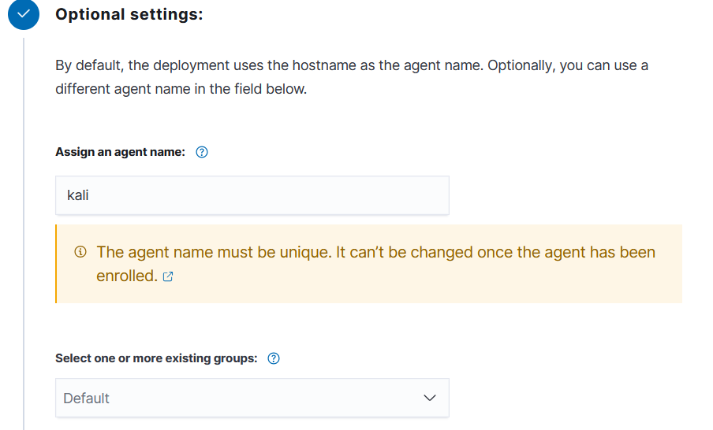
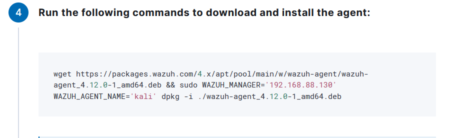
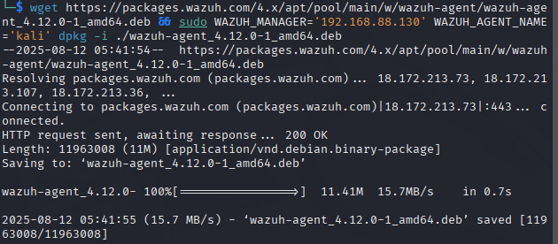
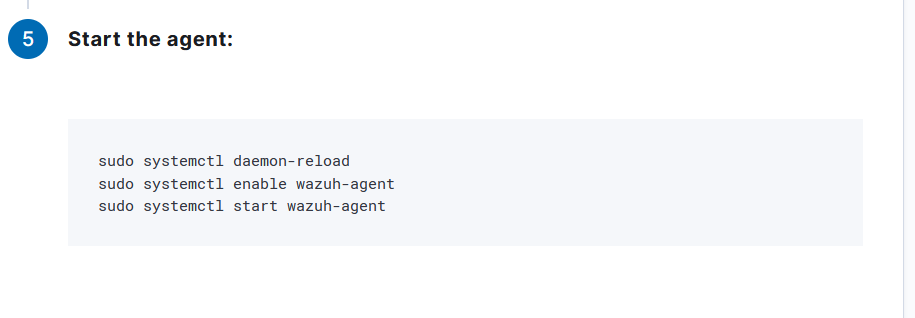
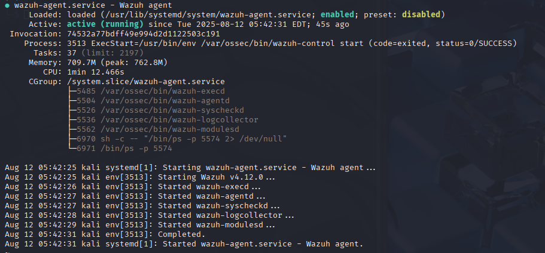
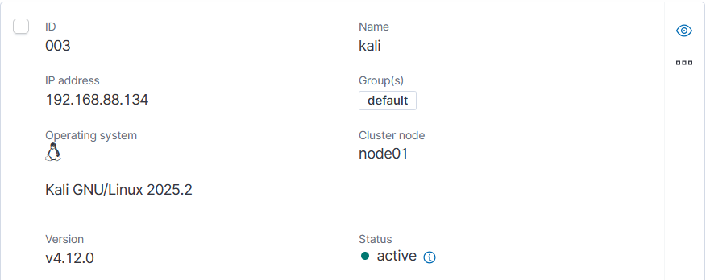

# Wazuh Agent Installation Guide - Kali Linux

## Prerequisites

- **Operating System**: Kali Linux (Rolling/Latest)
- **Architecture**: AMD64/x86_64
- **Root Access**: Required for installation
- **Network Access**: Ensure Kali can communicate with the Wazuh Manager
- **Updated System**: Recommended to update before installation

## Environment Details

- **Wazuh Manager IP**: `192.168.88.130`
- **Agent Name**: `kali`
- **Agent Group**: `default`

## Installation Steps

### Step 1: Access Wazuh Web Interface

1. Open your web browser and navigate to your Wazuh Manager dashboard
2. Go to **Agents** → **Deploy New Agent**

  


### Step 2: Select Package Type

From the deployment wizard:

1. **Select the package to download and install on your system:**
   - Choose **DEB amd64** for Kali Linux (Debian-based)

   

### Step 3: Configure Server Address

1. **Server address**: Enter your Wazuh Manager IP address
   ```
   192.168.88.130
   ```
2. Check **"Remember server address"** if desired

   

### Step 4: Optional Settings

1. **Assign an agent name** (optional):
   ```
   kali
   ```
   > **Note**: The agent name must be unique and cannot be changed once enrolled. If left blank, the hostname will be used.

2. **Select one or more existing groups**:
   - Default group is available if no custom group is needed

   

### Step 5: System Preparation

1. **Update package repositories**:
   ```bash
   sudo apt update && sudo apt upgrade -y
   ```

2. **Install required dependencies**:
   ```bash
   sudo apt install curl apt-transport-https lsb-release gnupg wget -y
   ```

3. **Check system architecture**:
   ```bash
   uname -m
   dpkg --print-architecture
   ```

### Step 6: Download and Install Agent

1. **Download the Wazuh agent package**:
   ```bash
   # Download the latest Wazuh agent
   curl -so wazuh-agent.deb https://packages.wazuh.com/4.x/apt/pool/main/w/wazuh-agent/wazuh-agent_4.12.0-1_amd64.deb
   
   ```
   

2. **Install the Wazuh agent**:
   ```bash
   # Install with environment variables
   sudo WAZUH_MANAGER="192.168.88.130" WAZUH_AGENT_NAME="Kali-Agent" dpkg -i ./wazuh-agent.deb
   ```
    
   

### Step 7: Start the Agent

1. **Enable and start the Wazuh agent service**:
   ```bash
   sudo systemctl daemon-reload
   sudo systemctl enable wazuh-agent
   sudo systemctl start wazuh-agent
   ```
   

2. **Verify the service is running**:
   ```bash
   sudo systemctl status wazuh-agent
   ```

   

## Kali-Specific Configuration
<!--
### Custom Monitoring for Penetration Testing Tools

Add specialized monitoring for Kali tools in `/var/ossec/etc/ossec.conf`:

```xml
 Monitor penetration testing tool usage 
<localfile>
  <log_format>command</log_format>
  <command>ps aux | grep -E "(nmap|metasploit|burp|sqlmap|hydra|john|hashcat)" | grep -v grep</command>
  <alias>pentest_tools</alias>
  <frequency>300</frequency>
</localfile>

 Monitor Kali-specific logs 
<localfile>
  <log_format>syslog</log_format>
  <location>/var/log/auth.log</location>
</localfile>

<localfile>
  <log_format>syslog</log_format>
  <location>/var/log/syslog</location>
</localfile>

Monitor command history for security analysis 
<localfile>
  <log_format>full_command</log_format>
  <location>/root/.bash_history</location>
  <alias>bash_history</alias>
</localfile>
```

<!-- 
### Create Custom Agent Group Rules

On the Wazuh Manager, create specific rules for penetration testing activities:

```bash
# Create custom group
sudo /var/ossec/bin/agent_control -g penetration-testing

# Add agent to group
sudo /var/ossec/bin/agent_groups -a -i <agent_id> -g penetration-testing
```
 -->


## Verification

### Check Agent Status on Manager

On your Wazuh Manager:




```bash
# List all agents
sudo /var/ossec/bin/agent_control -l

# Check specific agent status
sudo /var/ossec/bin/agent_control -i Kali-Agent

# View agent information
sudo /var/ossec/bin/agent_control -s -i <agent_id>
```

### Check Agent Status on Kali

```bash
# Check service status
sudo systemctl status wazuh-agent

# Check agent connectivity
sudo /var/ossec/bin/agent_control -t

# View recent logs
sudo tail -n 50 /var/ossec/logs/ossec.log

# Check agent configuration
sudo cat /var/ossec/etc/ossec.conf | grep -A 10 -B 5 server
```

## Troubleshooting

### Common Kali Linux Issues

1. **Package conflicts**:
   ```bash
   # Check for conflicting packages
   dpkg -l | grep ossec
   
   # Remove old OSSEC installations if present
   sudo apt remove ossec-hids-agent
   sudo apt autoremove
   ```

2. **Network connectivity issues**:
   ```bash
   # Test manager connectivity
   telnet 192.168.88.130 1514
   nc -zv 192.168.88.130 1514
   
   # Check iptables rules
   sudo iptables -L -n
   
   # Temporarily flush iptables (if needed)
   sudo iptables -F
   ```

3. **Service startup issues**:
   ```bash
   # Check service logs
   sudo journalctl -u wazuh-agent -f
   
   # Manual service control
   sudo /var/ossec/bin/wazuh-control start
   sudo /var/ossec/bin/wazuh-control status
   ```
<!--

### Kali Rolling Updates

Handle rolling release updates:

```bash
# Before major system updates
sudo systemctl stop wazuh-agent

# After system updates, check agent
sudo systemctl status wazuh-agent
sudo /var/ossec/bin/wazuh-control status

# Reinstall if needed
sudo dpkg-reconfigure wazuh-agent
```

## Security Considerations for Penetration Testing

### Legitimate vs Malicious Activity

Configure Wazuh to distinguish between authorized penetration testing and actual attacks:

1. **Whitelist testing activities**:
   ```xml
   <!-- Custom rule to ignore authorized scanning 
   <rule id="100001" level="0">
     <if_sid>5700</if_sid>
     <srcip>192.168.88.0/24</srcip>
     <description>Ignore authorized internal scanning</description>
   </rule>
   ```

2. **Time-based exceptions**:
   ```xml
   <!-- Ignore activities during testing hours -
   <rule id="100002" level="0">
     <if_sid>5700</if_sid>
     <time>09:00-17:00</time>
     <description>Ignore scanning during business hours</description>
   </rule>
   ```

### Compliance and Documentation

Monitor penetration testing activities for compliance:

```xml
<!-- Log all penetration testing tool usage -
<localfile>
  <log_format>full_command</log_format>
  <command>history | tail -n 10</command>
  <alias>recent_commands</alias>
  <frequency>60</frequency>
</localfile>
```

## Advanced Configuration

### Custom Decoders for Kali Tools

Create custom decoders in `/var/ossec/etc/decoders/local_decoder.xml`:

```xml
<decoder name="nmap-scan">
  <program_name>nmap</program_name>
  <regex offset="after_parent">^(\S+)\s+(\S+)\s+(\S+)\s+(.*)</regex>
  <order>target,status,protocol,details</order>
</decoder>

<decoder name="metasploit-session">
  <program_name>msfconsole</program_name>
  <regex>session (\d+) opened</regex>
  <order>session_id</order>
</decoder>
```

### Performance Optimization

```bash
# Optimize for Kali's resource usage
sudo nano /var/ossec/etc/ossec.conf

# Adjust log analysis settings
<global>
  <logall>no</logall>
  <logall_json>no</logall_json>
  <email_notification>no</email_notification>
</global>
```
-->

## Useful Commands

```bash
# Agent management
sudo systemctl restart wazuh-agent
sudo systemctl reload wazuh-agent

# Configuration testing
sudo /var/ossec/bin/wazuh-control configtest

# Manual agent enrollment
sudo /var/ossec/bin/agent-auth -m 192.168.88.130 -A Kali-Agent

# View active configuration
sudo /var/ossec/bin/ossec-control info

# Debug mode
sudo /var/ossec/bin/wazuh-control start-debug
```
<!--

## Integration with Kali Tools

### Monitor Tool Usage

```bash
# Create script to log tool usage
cat > /usr/local/bin/log-pentest-tools.sh << 'EOF'
#!/bin/bash
echo "$(date): $USER executed: $*" >> /var/log/pentest-activity.log
exec "$@"
EOF

chmod +x /usr/local/bin/log-pentest-tools.sh

# Add to Wazuh monitoring
echo '<localfile>
  <log_format>syslog</log_format>
  <location>/var/log/pentest-activity.log</location>
</localfile>' | sudo tee -a /var/ossec/etc/ossec.conf
```
-->
## Additional Resources

- [Kali Linux Documentation](https://www.kali.org/docs/)
- [Wazuh Agent Configuration](https://documentation.wazuh.com/current/user-manual/agents/index.html)
- [SIEM for Penetration Testing](https://documentation.wazuh.com/current/user-manual/use-cases/index.html)
- [Custom Rules and Decoders](https://documentation.wazuh.com/current/user-manual/ruleset/index.html)

---

**Last Updated**: August 2025  
**Wazuh Version**: 4.12.0  
**Tested On**: Kali Linux 2024.1 (Rolling)