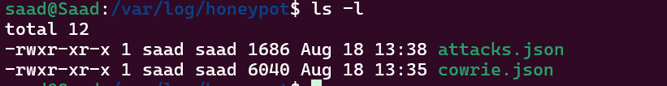
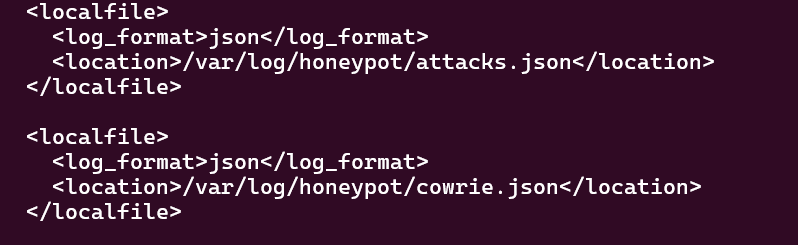
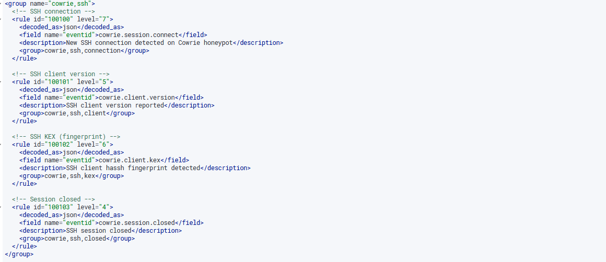
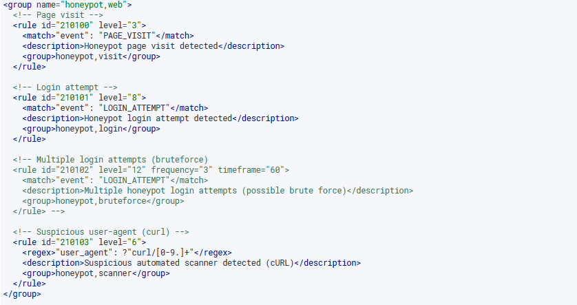
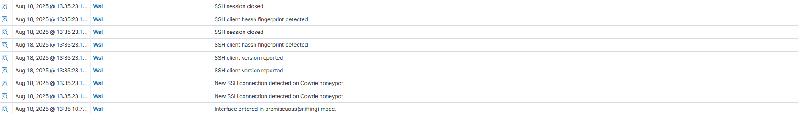

# 🛡️ Wazuh-DeceptiNet – Honeypot Integration with Wazuh SIEM

**Wazuh-DeceptiNet** integrates the existing **[Deceptinet](https://github.com/Saassoso/Deceptinet)** honeypot project with **Wazuh SIEM** for centralized monitoring and analysis of honeypot attacks. This setup provides real-time threat detection and comprehensive logging of all honeypot activities.

---

## 📌 Overview

This project extends the **Deceptinet** honeypot platform by:
- **Integrating honeypot logs** with Wazuh SIEM for centralized monitoring
- **Creating custom Wazuh rules** for honeypot attack detection
- **Building dashboards** for attack visualization and threat intelligence
- **Enabling real-time alerts** for critical honeypot events

### 🍯 Honeypot Components (from Deceptinet)
- **SSH Honeypot** – Cowrie captures SSH attacks, commands, and downloads
- **Web Honeypot** – Flask-based fake corporate portal for credential harvesting
- **JSON Logging** – Structured logs for easy SIEM integration

---

## 📂 Project Structure

```
Wazuh-DeceptiNet/
│
├── README.md                    # This documentation
├── docker-compose.yml           # Honeypot services (from Deceptinet)
├── .gitignore                   # Git configuration
│
├── config/                      # Honeypot configurations
│   └── cowrie.cfg              # SSH honeypot settings
│
├── web-honeypot/               # Web honeypot service
│   ├── Dockerfile              # Container build
│   └── app.py                  # Flask honeypot application
│
├── wazuh-integration/          # Wazuh SIEM integration files
│   ├── rules/                  # Custom Wazuh rules for honeypots
│   │   ├── honeypot-ssh.xml    # SSH honeypot detection rules
│   │   └── honeypot-web.xml    # Web honeypot detection rules
│   └── ossec.conf             # Agent configuration for log monitoring
│
└── screenshots/               # Documentation images
```

---

## 🚀 Deployment Guide

### 1️. Deploy Deceptinet Honeypots

```bash
# Go to  honeypots directory
cd Wazuh-DeceptiNet

# Start honeypot services
docker-compose up -d

# Verify services are running
docker-compose ps
```

### 2. Create log directories and files :

```bash
sudo mkdir /var/log/honeypot

sudo touch /var/log/honeypot/cowrie.json

sudo touch /var/log/honeypot/attaks.json
```
-

-

### 3. Wazuh Agent Configuration (ossec.conf)




### 4.Custom Wazuh Rules :
-Create custom Wazuh rules for :

    **Cowrie**




    **Web HoneyPot**




# Restart Wazuh Manager
```bash
sudo systemctl restart wazuh-manager
```

---

## 📊 Monitoring & Analysis


### Wazuh SIEM Analysis
- **Navigate to Wazuh Dashboard** → Security Events
- **Filter by Rule Groups:** `honeypot`, `ssh_honeypot`, `web_honeypot`
- **Create custom dashboards** for attack visualization
- **Set up email alerts** for high-priority honeypot events

    

---

## 📈 Current Status & Roadmap

### ✅ Completed Features
- [x] **SSH Honeypot** (Cowrie) with Wazuh integration
- [x] **Web Honeypot** (Flask) with structured logging
- [x] **Wazuh SIEM integration** with custom rules
- [x] **Docker deployment** for easy setup
- [x] **Local log analysis** tools

### 🎯 Future Enhancements
- [ ] **Dionaea Integration** – Low-interaction honeypot for malware capture
- [ ] **Additional Protocols** – RDP, SMB, FTP honeypots

---
