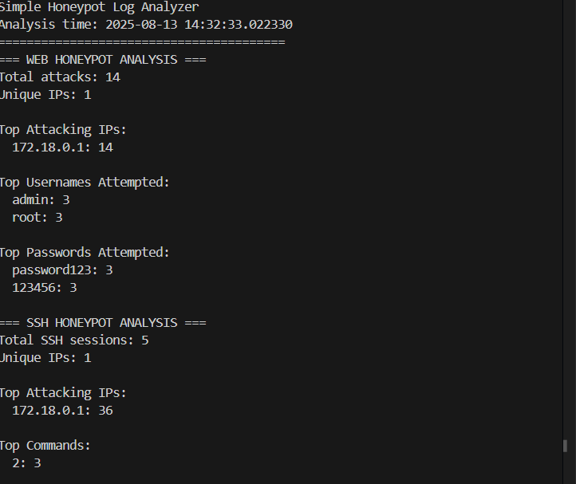

# 🕵️‍♂️ Deceptinet – Honeypot-Based Intrusion Detection & Analysis

Deceptinet is a **containerized multi-service honeypot environment** designed for capturing, analyzing, and enriching attacker activity data.  
It currently includes an **SSH honeypot** (Cowrie) and can be extended with web, SMB, RDP, and other protocol traps.  
Logs are stored locally in structured JSON format for easy parsing and can be forwarded to a SIEM (Wazuh, Splunk, Elastic Stack) for real-time threat detection.

---

## 📌 Features
- **SSH Honeypot with Cowrie** – Captures authentication attempts, executed commands, and file downloads.
- **Customizable Configuration** – Fake hostname, filesystem, and service banners to lure attackers.
- **Structured JSON Logs** – Easy to parse with SIEMs or the included Python analyzer.
- **Dockerized Deployment** – Quick setup with `docker-compose`.
- **Extensible** – Add web honeypots, malware traps, or other services.
- **Analysis Tools** – Included Python script for top IPs, usernames, passwords, and commands.

---

## 📂 Project Structure
```
Decetinet/
│
├── docker-compose.yml # Multi-service honeypot setup
├── config/
│ └── cowrie.cfg # Cowrie honeypot configuration
├── logs/
│ ├── ssh/ # Cowrie SSH logs (JSON)
│ └── web/ # Optional web honeypot logs
├── honeypot_analyzer.py # Python script to analyze honeypot logs
├── sample_logs/ # Example logs for testing
│ ├── web_attacks.json
│ └── ssh_cowrie.json
├── screenshots
└── README.md
```

---

## 🚀 Deployment
### 1️⃣ Clone the repository
```bash
git clone https://github.com/Saassoso/Decetinet.git
cd Decetinet
```

### 2️⃣ Configure the honeypot

- Edit config/cowrie.cfg to customize:
    - Fake hostname
    - Listening port (2222 default)
    - Banner (e.g., SSH-2.0-OpenSSH_6.0p1 Debian-4+deb7u2)

### 3️⃣ Start the honeypot

```bash
docker-compose up -d
```

📊 Log Analysis
Run the included Python analyzer to get top attacker IPs, usernames, passwords, and commands:

```bash
python honeypot_analyzer.py
```
Example output:



## Progress

- [X] **SSH-HoneyPot** (Cowrie)
- [ ] **Multi-Protocol Honeypots** (Cowrie)
- [X] **Web Honeypot** (Flask fake login)
- [ ] **Dionaea for malware capture**
- [ ] **Threat Intel Integration**
- [ ] **Auto-Run Script** (Cron Job)

