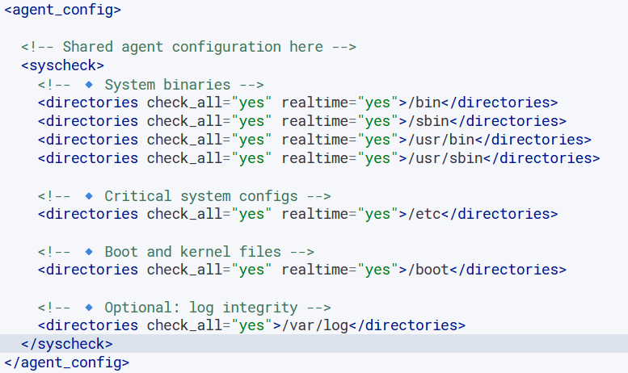
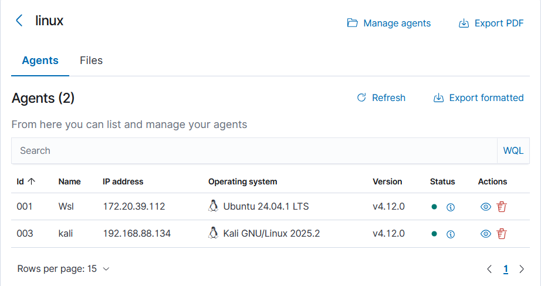
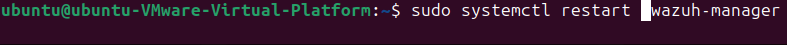
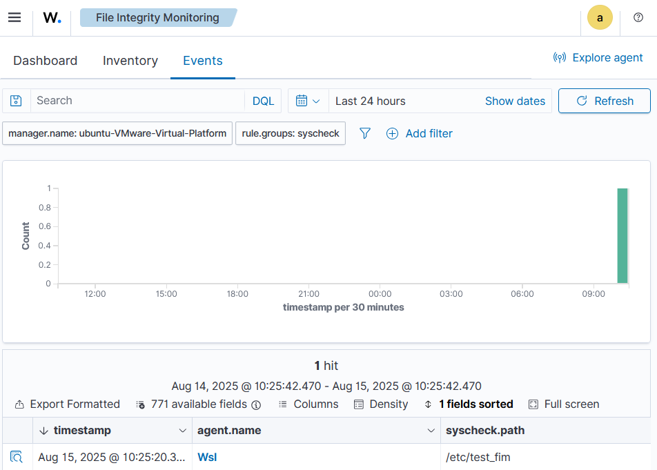

# 🔍 Wazuh File Integrity Monitoring (FIM) – Standard Linux Group

## 📖 Overview
This repository documents the process of configuring **File Integrity Monitoring (FIM)** in Wazuh for **standard Linux systems**.

The goal is to:
- Detect unauthorized changes to system binaries and configurations.
- Monitor critical OS files in real-time.
- Reduce security risks while avoiding unnecessary noise.

---

## 🛠 Step 1 – Create the `linux` Agent Group

Run the following command on your Wazuh Manager:

```bash
sudo /var/ossec/bin/agent_groups -a -g linux -q
```


----

## 📂 Step 2 – Modify Group Configuration File

Path to configuration file:

```
/var/ossec/etc/shared/linux/ossec.conf
```

**Configuration:**



---

## 🖥 Step 3 – Assign Agents to the `linux` Group

Replace `<agent_id>` with the actual ID of the agent:

```bash
sudo /var/ossec/bin/agent_groups -a -i <agent_id> -g linux
```



---

## 🔄 Step 4 – Restart Wazuh Manager

```bash
sudo systemctl restart wazuh-manager
```



---

## ✅ Step 5 – Verify FIM is Working

To trigger a test alert, modify a file in `/etc`:

```bash
sudo touch /etc/test_fim
```

Check alerts in the Wazuh dashboard under:

```
Security Events → Integrity Monitoring
```

**📸 Screenshot:**


---

## 📌 Notes

* `realtime="yes"` ensures immediate detection.
* `/var/log` monitoring is optional; disable if it generates excessive alerts.
* Adjust monitored paths based on your environment.

---

## 📂 Repository Structure

```
.
├── README.md                 # This documentation
└── screenshots/              # Folder for screenshots

