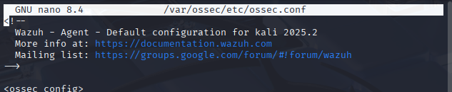
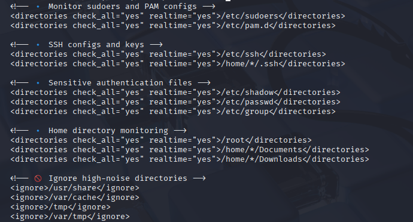
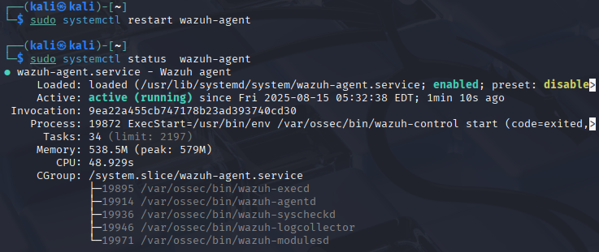

# 🐉 Wazuh FIM – Kali Linux (Local Agent Override)

## 📖 Overview
Kali Linux is a penetration testing distribution with frequent updates and volatile directories.  
Using the default `linux` FIM config would generate excessive noise.  
Instead, we override the agent’s local config to:
- Keep visibility on sensitive files.
- Ignore directories that change constantly.
- Avoid missing important changes during pentests.

---

## 🛠 Step 1 – Locate the Agent Config
On the Kali machine:

```bash
sudo nano /var/ossec/etc/ossec.conf
```
 

---

## 📂 Step 2 – Edit the FIM Section

Add this to the `<syscheck>` block :

 

---

## 🔄 Step 3 – Restart the Agent

Restart the Agent and check if it's still working after the change.

```bash
sudo systemctl restart wazuh-agent

sudo systemctl status wazuh-agent
```

 

## ✅ Step 4 – Verify FIM is Working

To trigger a test alert, modify a file in `/home/*/Documents/`:

```bash
sudo touch /home/kali/Documents/test_fim
```

Check alerts in the Wazuh dashboard under:

```
Security Events → Integrity Monitoring
```

**📸 Screenshot:**


---

## 📌 Notes

* This configuration **only affects this Kali agent**.
* All other Linux agents in the `linux` group still get the standard configuration.
* Use this method for any workstation where high-noise directories need to be ignored.

````
