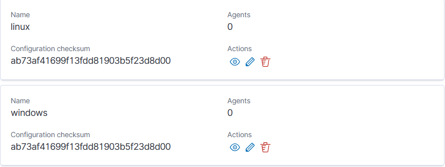

# 🛡️ Wazuh File Integrity Monitoring (FIM) – Multi-Platform Setup

## 📖 Overview
This project provides **File Integrity Monitoring (FIM)** configurations for Wazuh, tailored for multiple operating systems and use cases.

It includes:
- **Standard Linux group configuration** for servers and desktops.
- **Kali Linux (pentesting) local override** to reduce noise while keeping visibility on sensitive changes.
- **Windows group configuration** with additional registry monitoring for persistence detection.

These configurations are designed to:
- Detect unauthorized changes to critical files and directories in real-time.
- Minimize false positives in high-change environments.
- Provide platform-specific monitoring coverage without sacrificing security.


---

## 📂 Documentation Index

| Environment    | Config Type       | Link to Guide |
|----------------|------------------|---------------|
| **Linux**      | Shared group config | [📄 View Guide](Linux/README.md) |
| **Kali Linux** | Local agent override | [📄 View Guide](Linux/kali/README.md) |
| **Windows**    | Shared group config | [📄 View Guide](windows/README.md) |

---

## 🖥 Agent Group Strategy

| Environment    | Group Name | Config Location                                      | Notes |
|----------------|-----------|------------------------------------------------------|-------|
| Standard Linux | `linux`   | `/var/ossec/etc/shared/linux/ossec.conf`              | Same config for all Linux servers/desktops |
| Kali Linux     | `linux`   | `/var/ossec/etc/ossec.conf` (local override on agent) | Avoids creating extra group, tuned for pentesting |
| Windows        | `windows` | `/var/ossec/etc/shared/windows/ossec.conf`            | Includes registry key monitoring |

---

## 🚀 Quick Deployment

### **1. Create Agent Groups**
```bash
sudo /var/ossec/bin/agent_groups -a -g linux -q
sudo /var/ossec/bin/agent_groups -a -g windows -q
````
 

---

### **2. Apply Configurations**

* [**Linux** guide](Linux/README.md) → Save config to `/var/ossec/etc/shared/linux/ossec.conf`
* [**Kali** guide](Linux/kali/README.md) → Edit   `/var/ossec/etc/ossec.conf` directly on agent
* [**Windows** guide](Windows/README.md) → Save config to `/var/ossec/etc/shared/windows/ossec.conf`

---

### **3. Assign Agents**

```bash
# Linux
sudo /var/ossec/bin/agent_groups -a -i <agent_id> -g linux

# Windows
sudo /var/ossec/bin/agent_groups -a -i <agent_id> -g windows

```

---

### **4. Restart Wazuh Manager**

```bash
sudo systemctl restart wazuh-manager
```

---

## 📌 Notes

* Always **test a change** after setup to confirm alerts appear in the Wazuh dashboard.
* Keep `realtime="yes"` for critical paths.
* Ignore volatile directories on Kali to reduce false positives.
* Monitor persistence registry keys on Windows for malware detection.

---

## 📂 Repository Structure

```
.
├── README.md                 # This documentation
└── screenshots/              # Folder for screenshots
