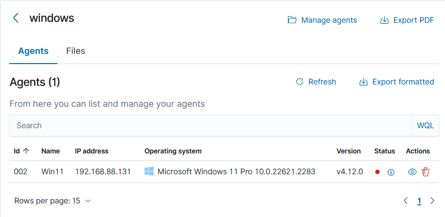

# 🪟 Wazuh FIM – Windows Group

## 📖 Overview
Windows endpoints require monitoring for:
- Critical system files.
- Persistence points.
- Registry keys that can be abused by malware.

We’ll create a dedicated group `windows` with its own configuration.

---

## 🛠 Step 1 – Create the `windows` Group

```bash
sudo /var/ossec/bin/agent_groups -a -g windows -q
```
 

---

## 📂 Step 2 – Create Group Configuration

Path:

```
/var/ossec/etc/shared/windows/ossec.conf
```

**Configuration:**

 

---

## 🖥 Step 3 – Assign Windows Agents

```bash
sudo /var/ossec/bin/agent_groups -a windows -i <agent_id>
```
 
---

## 🔄 Step 4 – Restart Wazuh Manager

```bash
sudo systemctl restart wazuh-manager
```
 

```


