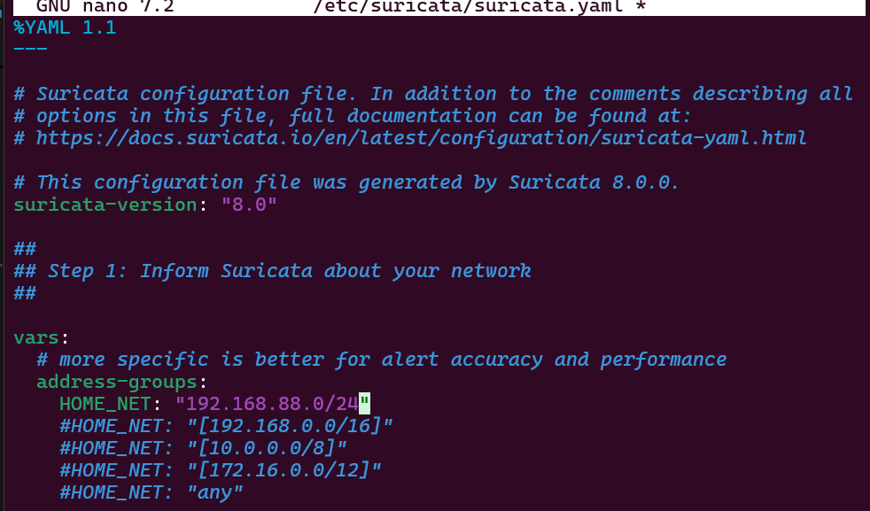

# Suricata Installation Guide - WSL Ubuntu 

## Prerequisites

- **Operating System**: Windows  with WSL2 enabled
- **WSL Distribution**: Ubuntu 24.04 LTS
- **Administrative Privileges**: Required for installation and network access
- **Network Access**: Internet connectivity for package downloads and updates

## Environment Details

- **Instance Name**: `WSL`
- **WSL Distribution**: Ubuntu 24.04 LTS
- **Target Network**: (WSL shares the same network address as the Windows PC)
- **Log Integration**: Wazuh Manager at `192.168.88.130`

## Installation Steps

### Step 1: Install Suricata on WSL Ubuntu

1. **Update system and add Suricata repository**:

 ```bash
   # Update package lists
   sudo apt update
   ```

 

```bash
   # Add OISF repository
   sudo add-apt-repository ppa:oisf/suricata-stable
   sudo apt-get update
   ```

 

2. **Install Suricata**:
```bash
   # Install Suricata (tested with version 6.0.8)
   sudo apt-get install suricata -y
   
   # Verify installation
   suricata --version
   ```

   

### Step 2: Download Emerging Threats Ruleset

1. **Download and extract rules**:

 ```bash
   # Download rules to temporary directory
   cd /tmp/ && curl -LO https://rules.emergingthreats.net/open/suricata-6.0.8/emerging.rules.tar.gz

   # Extract and move rules
   sudo tar -xvzf emerging.rules.tar.gz && sudo mkdir -p /etc/suricata/rules && sudo mv rules/*.rules /etc/suricata/rules/

   # Set proper permissions
   sudo chmod 640 /etc/suricata/rules/*.rules
   ```

   

### Step 3: Configure Suricata

1. **Edit Suricata configuration**:

```bash
   # Edit the main configuration file
   sudo nano /etc/suricata/suricata.yaml
   ```

2. **Modify key settings**:

```yaml
   vars:
     address-groups:
       HOME_NET: "172.20.39.112"  # Your network range
       EXTERNAL_NET: "any"

   default-rule-path: /etc/suricata/rules
   rule-files:
     - "*.rules"

   # Global stats configuration
   stats:
     enabled: yes

   # Linux high speed capture support
   af-packet:
     - interface: eth0  # WSL network interface
   ```

   

   3. **Restart Suricata Service**:
```bash 
   sudo systemclt restart suricata
   ```

### Step 4: Verify Network Interface

1. **Check network interface name**:

```bash
   # List network interfaces
   ifconfig
   ```

    Output:
```bash
    eth0: flags=4163<UP,BROADCAST,RUNNING,MULTICAST>  mtu 1500
        inet 172.20.39.112  netmask 255.255.240.0  broadcast 172.20.47.255
        inet6 fe80::215:5dff:feab:8479  prefixlen 64  scopeid 0x20<link>
        ether 00:15:5d:ab:84:79  txqueuelen 1000  (Ethernet)
        RX packets 25108  bytes 26079161 (26.0 MB)
        RX errors 0  dropped 0  overruns 0  frame 0
        TX packets 13957  bytes 5514158 (5.5 MB)
        TX errors 0  dropped 0 overruns 0  carrier 0  collisions 0
   ```

   Update the interface name in `/etc/suricata/suricata.yaml` if different from `eth0`.

   

### Step 5: Configure Wazuh Integration

1. **Add Suricata log monitoring to Wazuh agent**:
```bash
   # Edit Wazuh agent configuration
   sudo nano /var/ossec/etc/ossec.conf
   ```

   Add the following configuration:
```xml
   <ossec_config>
     <localfile>
       <log_format>json</log_format>
       <location>/var/log/suricata/eve.json</location>
     </localfile>
   </ossec_config>
   ```
   

2. **Restart Wazuh agent**:
```bash
   sudo systemctl restart wazuh-agent
   ```
   
   

   ---

**Last Updated**: August 2025  
**Suricata Version**: 8.0.0
**Tested On**: Windows Subsystem for linux 
**Integration**: Wazuh SIEM v4.12.0