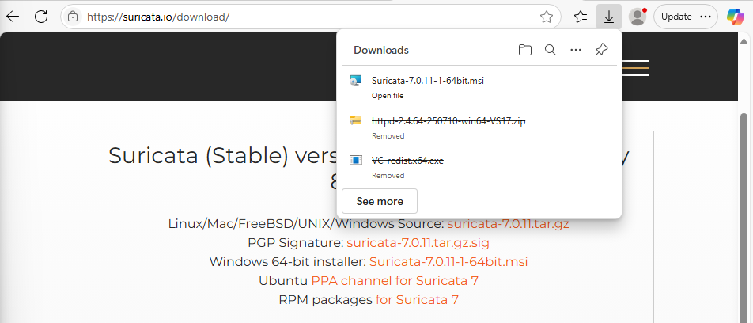
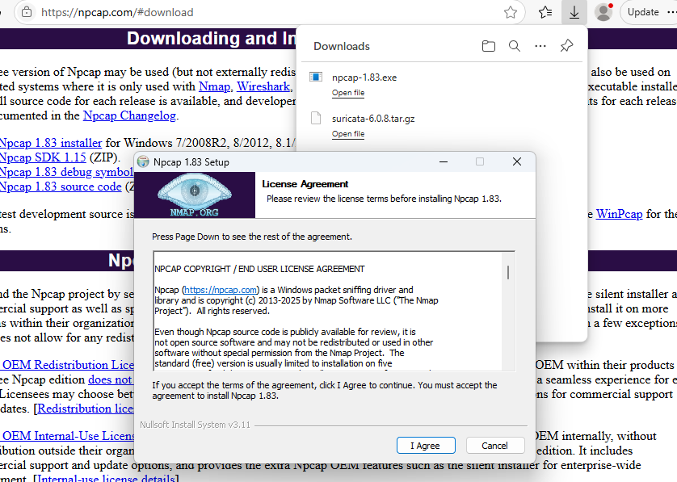
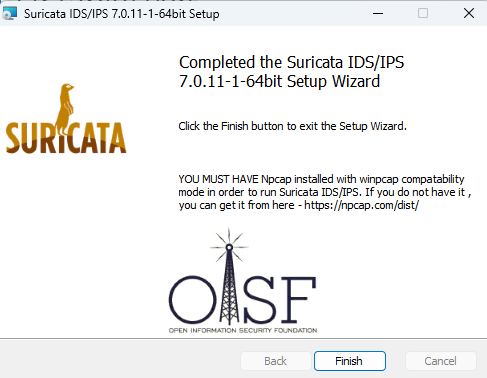
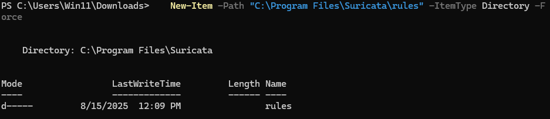
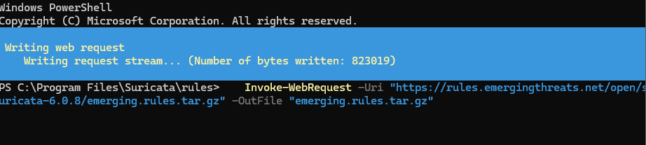
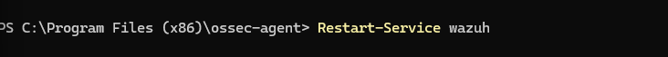
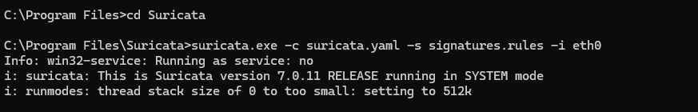
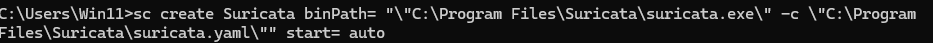
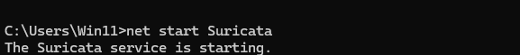

# Suricata Installation Guide - Windows  

## Prerequisites

- **Operating System**: Windows System
- **Administrative Privileges**: Required for installation and network interface access
- **Network Access**: Internet connectivity for downloading packages and rule updates
- **Hardware**: Minimum 4GB RAM, 4+ CPU cores recommended

## Environment Details

- **Instance Name**: `Windows`
- **Target Network**: `192.168.88.0/24`
- **Management Interface**: Primary network adapter
- **Log Integration**: Wazuh Manager at `192.168.88.130`

## Installation Steps

### Step 1: Download Suricata for Windows

1. **Download the Windows installer**:

   

### Step 2: Install Suricata

1. **Instal Npcap**:
Suricata on Windows depends on Npcap (or WinPcap) to capture packet

 

2. **Run the MSI installer as Administrator**:




### Step 3: Download Emerging Threats Rules

1. **Download and extract rules**:
```powershell
   # Create rules directory
   New-Item -Path "C:\Program Files\Suricata\rules" -ItemType Directory -Force
```

 


```powershell
   # Download rules
   cd "C:\Program Files\Suricata\rules"
   Invoke-WebRequest -Uri "https://rules.emergingthreats.net/open/suricata-6.0.8/emerging.rules.tar.gz" -OutFile "emerging.rules.tar.gz"
   
   # Extract rules (requires 7-Zip or similar extraction tool)
   # After extraction, ensure *.rules files are in C:\Program Files\Suricata\rules\
   ```

   

### Step 4: Configure Suricata

1. **Get Network Interface**:

```powershell
PS C:\Program Files\Suricata> Get-NetAdapter | ForEach-Object {
 $guid = $_.InterfaceGuid
     Write-Output "\Device\NPF_{$guid}  ($($_.Name))" }
```


2. **Edit the configuration file**:
   ```powershell
   # Edit Suricata configuration
   notepad "C:\Program Files\Suricata\suricata.yaml"
   ```

3. **Modify key settings**:
   ```yaml
   vars:
     address-groups:
       HOME_NET: "192.168.88.0/24"
       EXTERNAL_NET: "any"

   default-rule-path: C:\Program Files\Suricata\rules
   rule-files:
     - "*.rules"

   # Windows interface configuration
   pcap:
     - interface: "\\Device\\NPF_{INTERFACE-GUID}"
   
   outputs:
     - eve-log:
         enabled: yes
         filename: C:\Program Files\Suricata\logs\eve.json
         types:
           - alert
           - http
           - dns
           - tls
   ```

   


### Step 5: Configure Wazuh Integration

1. **Add Suricata log monitoring to Wazuh agent**:
   Edit `C:\Program Files (x86)\ossec-agent\ossec.conf`:
   
   ```xml
   <ossec_config>
     <localfile>
       <log_format>json</log_format>
       <location>C:\Program Files\Suricata\logs\eve.json</location>
     </localfile>
   </ossec_config>
   ```

2. **Restart Wazuh agent**:
   ```powershell
   Restart-Service wazuh

   ```

   

### Step 6: Start Suricata

1. **Start Suricata**:

 

2. **Create Suricata Service**:

 

3. **Start Suricata Service**:

 

## Additional Resources

- [Suricata Documentation](https://docs.suricata.io/)
- [Windows Installation Guide](https://docs.suricata.io/en/latest/install.html#windows)
- [Rule Management](https://docs.suricata.io/en/latest/rules/index.html)
- [Performance Tuning](https://docs.suricata.io/en/latest/performance/index.html)

---

**Last Updated**: August 2025  
**Suricata Version**: 8.0.0 
**Tested On**: Windows 11   
**Integration**: Wazuh SIEM v4.12.0