# Wazuh Manager Installation

## Overview
Wazuh is a free and open source security platform that unifies XDR and SIEM capabilities. It protects workloads across on-premises, virtualized, containerized, and cloud-based environments.

This guide covers the installation of Wazuh Manager on Ubuntu Server 22.04 LTS. The Wazuh Manager serves as the central SIEM platform for collecting and analyzing security events from endpoints.

## System Requirements
- **OS**: Ubuntu 24.04.2 LTS
- **CPU**: 2 vCPUs minimum (4 recommended)
- **RAM**: 4GB minimum (11GB given)  
- **Storage**: 50GB minimum (70GB given)
- **Network**: Static IP (192.168.88.130)

---

## Installation Steps

### Step 1: Update System
Update the system packages and install prerequisites:

```bash
sudo apt update && sudo apt upgrade -y
```

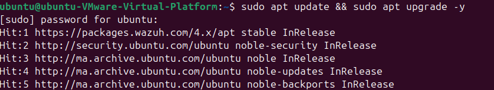

Install required dependencies:

```bash
sudo apt install curl apt-transport-https lsb-release gnupg2 wget -y
```

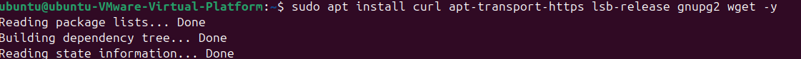

### Step 2: Add Wazuh Repository
Create a wazuh Repository

```bash
sudo mkdir wazuh
```


Download the Wazuh installation assistant and the configuration file.

```bash
sudo curl -sO https://packages.wazuh.com/4.12/wazuh-install.sh
sudo curl -sO https://packages.wazuh.com/4.12/config.yml
```


Edit the configuration, with same Ip @, As all the compenents are in the same server.

```bash
sudo nano ./config.yml
```
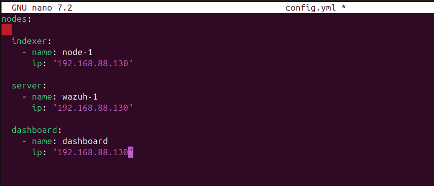

### Step 3: Wazuh Installation

Run the Wazuh automated installation assistant with option -a to install and configure Wazuh server, Wazuh indexer, Wazuh dashboard (--all-in-one). And -o to overwrites previously installed components. 

```bash
sudo nano ./config.yml
```
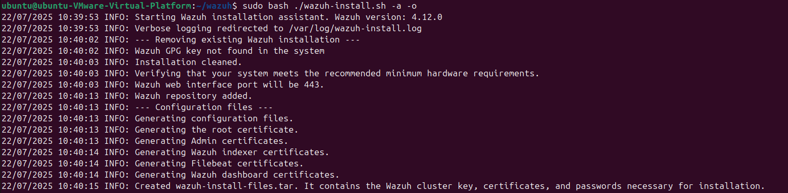

Wazuh indexer nodes

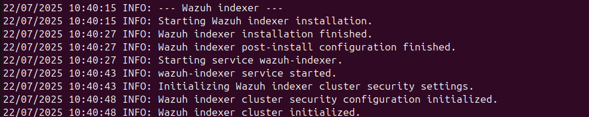

Wazuh server 

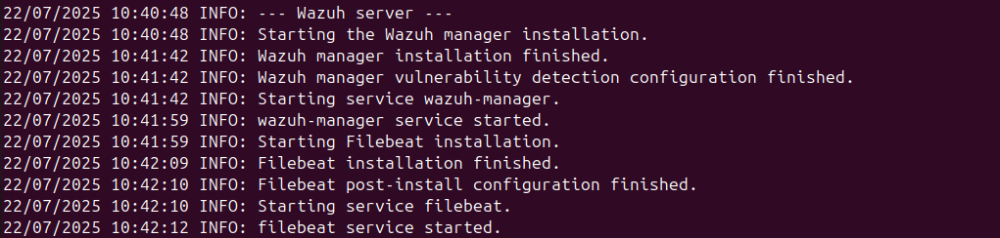

Wazuh dashboard

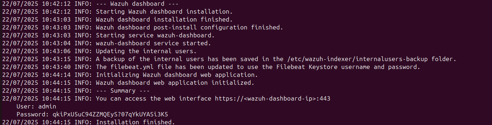

### Step 4: Verify Installation

Check all services are running:

```bash
sudo systemctl status wazuh-manager wazuh-indexer wazuh-dashboard
```

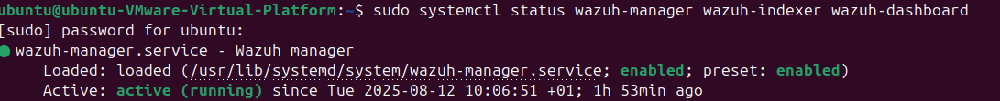

---

## Web Dashboard Access

### Access the Dashboard
Open your web browser and navigate to:
```
https://192.168.88.130
```

Accept the self-signed certificate warning.

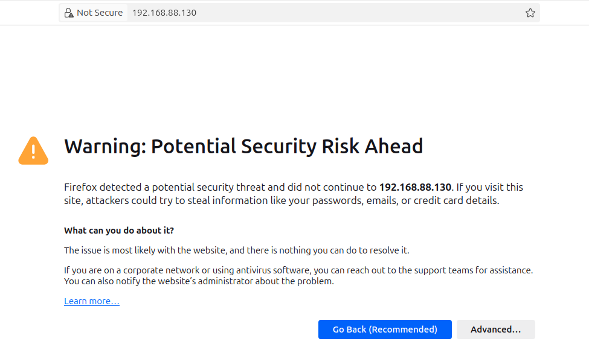

### Login
Use the default credentials:
- **Username**: `admin`
- **Password**: `qkiPxU5uC94ZZMQEyS?07qYkUYASi3K5`

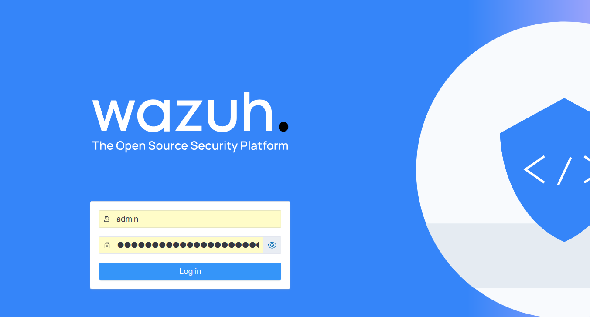

### Dashboard Overview
After successful login, you'll see the main dashboard:

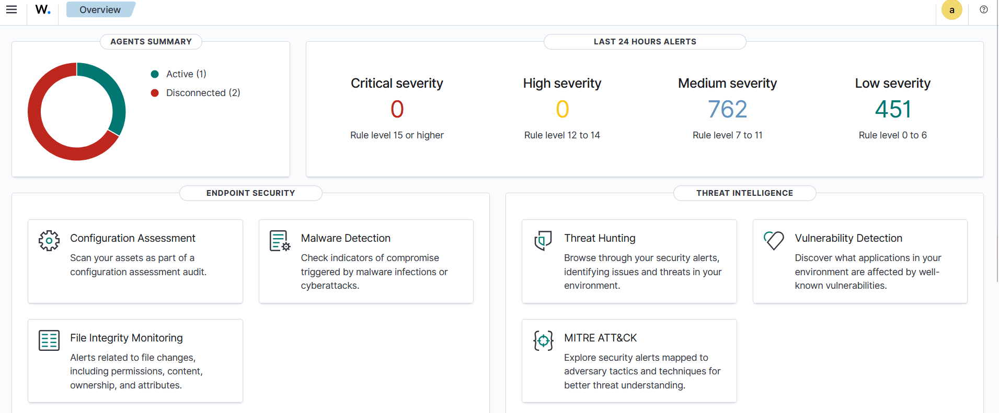

---

## Agent Management

### Check Connected Agents
List all connected agents:

```bash
sudo /var/ossec/bin/agent_control -l
```

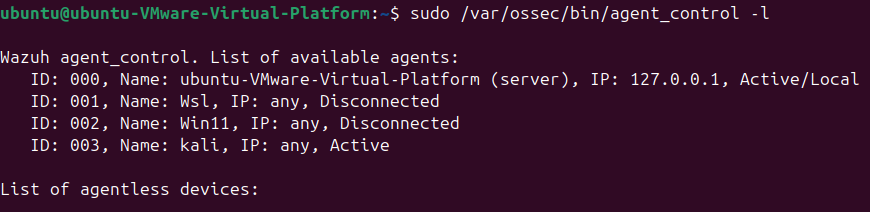

### View Agent Details
Check specific agent status:

```bash
sudo /var/ossec/bin/agent_control -i 001
```


---

## Configuration Files

### Main Configuration
The main configuration file is located at:
```
/var/ossec/etc/ossec.conf
```

### Logs Location
Wazuh logs are stored in:
```
/var/ossec/logs/
```

View recent alerts:

```bash
sudo tail -f /var/ossec/logs/alerts/alerts.log
```

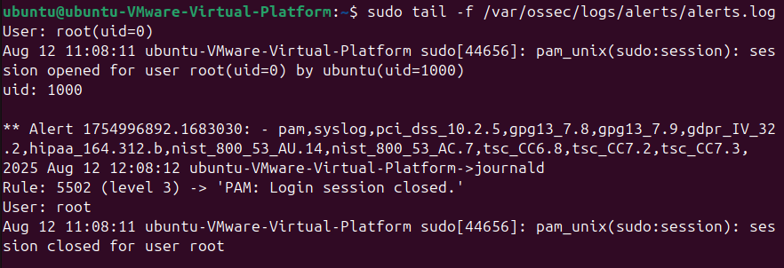

---

