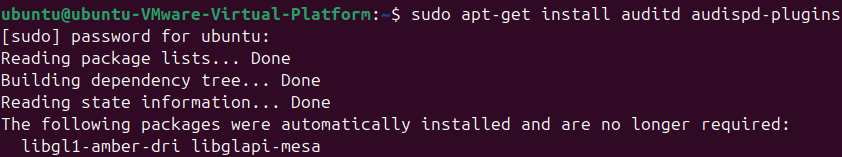
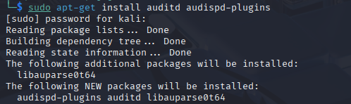
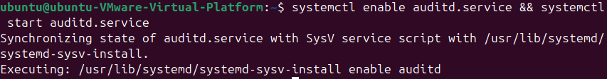
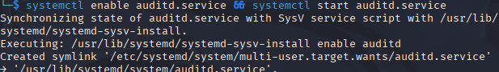
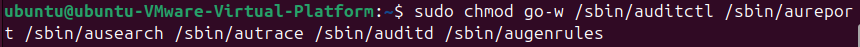
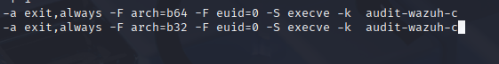
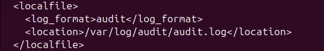
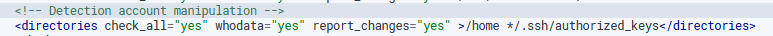
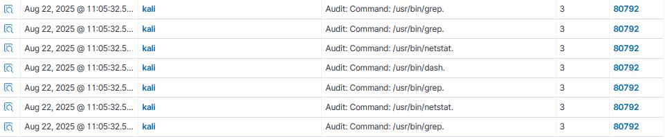

# Auditd Integration Guide

## Overview

Auditd (Linux Audit Daemon) is the userspace component of the Linux auditing system that provides detailed logging of system events, including system calls, file access, network connections, and user authentication. This guide covers the complete integration of Auditd with Wazuh for enhanced Linux system monitoring and threat detection.

The integration enables real-time monitoring of critical system activities with user attribution (who-data), making it invaluable for compliance, forensics, and advanced threat hunting.

---

## Prerequisites

### System Requirements
- **Operating System**: Linux (Ubuntu 20.04+, CentOS 7+, RHEL 7+)
- **Privileges**: Root or sudo access required
- **Disk Space**: Minimum 2GB for audit logs (varies by activity level)
- **Network**: Connectivity to Wazuh Manager (192.168.88.130)
- **Wazuh Agent**: Must be installed and configured

### Package Dependencies
```bash
# Ubuntu/Debian
sudo apt update
sudo apt install auditd audispd-plugins
```

## Installation and Configuration

### Step 1: Install Auditd

#### Ubuntu/Debian Systems
```bash
# Update package repository
sudo apt update

# Install auditd and related tools
sudo apt install auditd audispd-plugins -y

# Verify installation
auditctl --version
```






### Step 2: Enable and Start Auditd

#### Enable and Start Auditd
```bash
# Enable auditd service
sudo systemctl enable auditd

# Start auditd service
sudo systemctl start auditd

# Verify service status
sudo systemctl status auditd
```




- Reduce permissions for security reasons :



### Step 3: Configure Audit Rules

#### Wazuh Audit Rules

```bash
# Edit auditd rule configuration file
sudo nano /etc/audit/rules.d/audit.rules
```




### Step 4: Configure Wazuh Agent Integration

#### Configure Wazuh Agent for Auditd
```bash
# Edit Wazuh agent configuration
sudo nano /var/ossec/etc/ossec.conf
```



#### Restart Wazuh Agent

```bash
# Restart wazuh Agent
sudo systemctl restart wazuh-agent
```

### Step 5 : Who-data monitoring

The who-data functionality allows the FIM module to obtain information about who made modifications to a monitored file. This information contains the user who made the changes to the monitored files and the program name or process used.

- Add the configuration below within the FiM :


- Configure the provider tag: 


**Use Cases** :
-    *** Monitor changes in the /etc/hosts.allow file on Linux :***

 -   *** Detecting Account Manipulation :***


#### Test Result :




**Last Updated**: August 2025  
**Testing**: Validated with account manipulation and file monitoring
