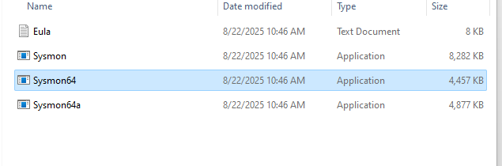
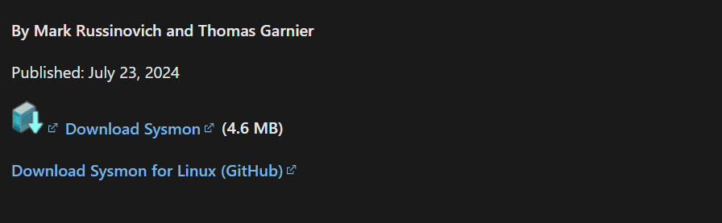
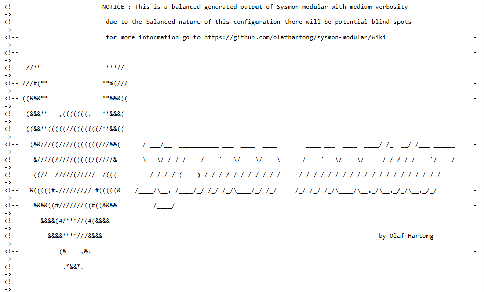

# Sysmon Integration Guide

## Overview

Sysmon (System Monitor) is a Windows system service that logs system activity to the Windows Event Log, providing detailed information about process creations, network connections, file modifications, and other security-relevant events. This guide covers the complete integration of Sysmon with Wazuh for enhanced Windows system monitoring and threat detection.

Sysmon generates high-fidelity telemetry that enables advanced threat hunting, malware analysis, and behavioral detection across Windows environments.

---

## Prerequisites

### System Requirements
- **Operating System**: Windows 10/11, Windows Server 2016/2019/2022
- **Privileges**: Administrator access required
- **Wazuh Agent**: Must be installed and configured
- **PowerShell**: Version 5.0 or higher
- **Disk Space**: Minimum 5GB for event logs (varies by activity level)

### Dependencies
- Windows Event Log service running
- Sufficient event log storage configured
- Network connectivity to Wazuh Manager (192.168.88.130)

---

## Installation and Configuration

### Step 1: Download and Install Sysmon

#### Download Sysmon from Microsoft
```powershell
# Open PowerShell as Administrator
# Download Sysmon from Microsoft Sysinternals
Invoke-WebRequest -Uri "https://download.sysinternals.com/files/Sysmon.zip" -OutFile "C:\Users\Win11\Downloads\Sysmon.zip"

# Extract Sysmon
Expand-Archive -Path "C:\Users\Win11\Downloads\Sysmon.zip"-DestinationPath "C:\ysmon"
```


#### Alternative: Direct Download
Visit: https://docs.microsoft.com/en-us/sysinternals/downloads/sysmon



### Step 2: Create Sysmon Configuration

#### Use Comprehensive Sysmon Configuration

- Pre-Grenerated configurations default+ config file , a balanced configuration, most used, more information including FileDelete file saves.

[olafhartong/sysmon-modular](https://github.com/olafhartong/sysmon-modular)

**Sysmon Configuration (sysmonconfig.xml):**


### Step 3 : 